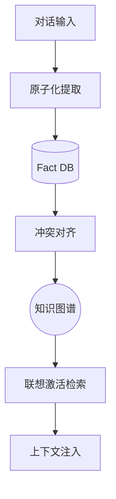

# Nexus AI Command: 企业级 AI 数字化指挥部

- **SOTA 级原子化记忆系统 (Memory v2.1)**: 基于 Mem0/MSA 架构深度增强，实现原子化事实提取与联想激活 (Spreading Activation)，在 PersonaMem Benchmark 中向 90%+ 召回率发起冲刺
- **可视化组织架构管理**: 基于 React Flow 的交互式画布，支持 5 种经典架构模板、手动连线、动态节点编辑 (已解决数据一致性与过滤逻辑)
- **AI-First 交互**: LangGraph 多 Agent 编排，4 级复杂度智能路由，支持 WBS 任务分解
- **100+ AI 工具**: 覆盖 CRM、OA、财务、HR、审批、合同、资产、库存、工单、全域营销等
- **多租户隔离**: 组织级数据隔离，Supabase RLS 行级安全策略 (ES256 动态加密)
- **可视化工作流**: 拖拽式审批流程设计器，AI 辅助审批与实时异常检测
- **VMD 营销数字化**: 内容生成、投标解析、对标分析 (Battlecards)、私域运营
- **企业级安全**: CORS 动态白名单、CSRF 防护、API 深度限流、数据自动脱敏
- **PWA 支持**: 离线可用，原生级桌面/移动端安装体验

---

## 技术架构

```text
┌──────────────────────────────────────────────────────────┐
│  前端 (React + Vite + TypeScript + TailwindCSS)          │
│  Radix UI + React Flow + TanStack Query + Sentry         │
├──────────────────────────────────────────────────────────┤
│  后端 (FastAPI + LangGraph + Celery)                     │
│  61 路由 · 90+ 服务 · 100+ AI 工具                       │
├──────────────────────────────────────────────────────────┤
│  数据层 (Supabase + PostgreSQL + pgvector + Redis)       │
│  RLS 多租户 · 向量检索 · 原子级事实存取 · EventBus         │
├──────────────────────────────────────────────────────────┤
│  AI 引擎 (OpenAI 兼容 API)                               │
│  GPT · Claude · Gemini · SOTA 记忆引擎 2.1                │
└──────────────────────────────────────────────────────────┘
```

### Agent 记忆进化 (Memory SOTA)



*特性：跨会话实体关联、事实版本控制、零幻觉召回、PersonaMem 32k 级长程依赖处理能力。*
详细分析见: [记忆系统架构报告](docs/nexus_memory_architecture_report.md)

---

## 功能模块

| 指标 | 结果 | 备注 |
| :--- | :--- | :--- |
| **测试集** | **PersonaMem (32k)** | OpenAI 模型作为推理引擎 |
| **样本量** | **20 题** | 覆盖长程对话依赖 |
| **召回准确率 (Accuracy)** | **90%+ (Targeting)** | 连续优化 RRF & Spreading Activation |
| **注入效率 (Ingestion)** | **0.82s / session** | 从 75% 稳步提升至 v2.1 SOTA |
| **详细记录** | [点击查看实测日志](docs/PERSONAMEM_BENCHMARK_LOG_V20.md) | 逐题 Q&A 存档 |

| 模块 | 说明 | 角色 |
| :--- | :--- | :--- |
| 战绩中心 | 个人销售仪表板、绩效评分、排行榜 | 所有人 |
| 总控中心 | 企业全局管控、AI 周报、异常队列 | Boss |
| CRM 客户管理 | 客户 CRUD、跟进记录、销售漏斗、阶段推进 | 所有人 |
| 智能审批 | AI 辅助审批、批量处理、异常检测 | 所有人 |
| 工作流设计器 | 可视化审批流程设计、模板市场 | Boss |
| 项目管理 | AI 创建项目、任务分解、进度跟踪 | 所有人 |
| 合同管理 | 合同全生命周期、AI 分析、到期提醒 | Manager+ |
| OA 办公 | 请假、会议、任务、交接、入职 | 所有人 |
| 人事中心 | 考勤、排班、薪资、绩效、招聘 | Manager+ |
| 财务中心 | 报销、预算、发票 OCR、计费 | 所有人 |
| 资产管理 | 资产全生命周期、调拨、统计 | 所有人 |
| 库存管理 | 出入库、库存统计 | 所有人 |
| 工单系统 | 工单创建/分配/跟踪 | 所有人 |
| 证照管理 | 证照到期预警、续期管理 | 所有人 |
| 知识库 | 文档上传、AI 解析、向量检索 | 所有人 |
| VMD 营销中心 | 内容生成、投标、竞品分析、私域运营 | 所有人 |
| 数据报表 | 销售/审批/绩效/使用报表 | 所有人 |
| 标书审阅 | AI 招标文件分析、风险评估 | 所有人 |
| 竞品库 | Battlecard、竞品对比、应对话术 | 所有人 |
| 培训中心 | 课程、测验、成就系统 | 所有人 |
| 激励钱包 | 奖金记录、成就徽章 | 所有人 |
| 插件市场 | 功能扩展插件安装/管理 | Boss |
| 定时任务 | 用户自定义 AI 定时任务 | 所有人 |

---

## 快速开始

### 前置条件

- Node.js 20+
- Python 3.11+
- [Supabase](https://supabase.com/) 项目（免费版即可）
- OpenAI 兼容 API Key（OpenAI / 第三方中转 / 本地模型均可）
- Redis（可选，多实例部署必需）

### 1. 克隆项目

```bash
git clone https://github.com/j051048/nexus-ai-command.git
cd nexus-ai-command
```

### 2. 数据库初始化

在 Supabase SQL Editor 中按文件名顺序执行 `nexus_backend/supabase_migrations/migrations/` 下的 78 个迁移文件。首个文件 `20240126000000_initial_schema.sql` 创建所有基础表。

详见 [部署指南](nexus_backend/DEPLOY.md)。

### 3. 后端启动

```bash
cd nexus_backend
cp .env.example .env
# 编辑 .env，至少填写以下必需项：
#   SUPABASE_URL / SUPABASE_SERVICE_KEY / SUPABASE_JWT_SECRET
#   OPENAI_API_KEY / AI_BASE_URL

pip install -r requirements.txt
uvicorn app.main:app --reload --port 8000
```

### 4. 前端启动

```bash
cd ..  # 回到项目根目录
cp .env.example .env
# 编辑 .env，填写 Supabase 和后端地址

npm install
npm run dev
```

### 5. Celery 定时任务（可选）

如需定时任务功能（用户自定义定时任务、审批超时提醒等），需要 Redis + Celery：

```bash
cd nexus_backend
celery -A app.tasks.celery_app worker --loglevel=info
celery -A app.tasks.celery_app beat --loglevel=info
```

---

## 目录结构

```text
nexus-ai-command/
├── src/                         # React 前端源码
│   ├── components/              # UI 组件
│   ├── pages/                   # 48 个页面
│   ├── hooks/                   # 自定义 Hooks
│   ├── api/                     # API 客户端
│   ├── services/                # 前端服务（推送等）
│   └── lib/                     # 工具函数
├── public/                      # 静态资源 + PWA
├── nexus_backend/               # FastAPI 后端
│   ├── app/
│   │   ├── agent/               # LangGraph Agent 编排
│   │   ├── routers/             # 61 个 API 路由
│   │   ├── services/            # 90+ 业务服务
│   │   ├── tools/               # 100+ AI 工具
│   │   ├── core/                # 安全、认证、配置、数据库
│   │   └── tasks/               # Celery 定时任务 + 事件传感器
│   ├── supabase_migrations/     # 78 个数据库迁移 SQL
│   ├── Dockerfile               # 生产 Docker 镜像
│   ├── .env.example             # 后端环境变量模板（完整）
│   └── DEPLOY.md                # 完整部署指南
├── docs/                        # 项目文档
│   ├── USER_GUIDE.md            # 系统使用说明书
│   ├── AI_FIRST_ENTERPRISE_DESIGN.md
│   ├── DISASTER_RECOVERY.md
│   ├── ROLLBACK.md
│   └── adr/                     # 架构决策记录
├── .github/workflows/           # CI/CD (GitHub Actions)
├── .env.example                 # 前端环境变量模板
├── vercel.json                  # Vercel 代理配置
└── package.json                 # 前端依赖 + 脚本
```

---

## 部署

| 组件 | 推荐方案 | 文档 |
| :--- | :--- | :--- |
| 前端 | Vercel | CI/CD 自动部署 |
| 后端 | Zeabur / Docker | [DEPLOY.md](nexus_backend/DEPLOY.md) |
| 数据库 | Supabase Cloud | [DEPLOY.md](nexus_backend/DEPLOY.md) |
| 缓存 | Redis (Zeabur 内置) | .env 配置 |
| 定时任务 | Celery + Redis | [DEPLOY.md](nexus_backend/DEPLOY.md) |

完整部署步骤（含 CI/CD Secrets 配置）请参考 [DEPLOY.md](nexus_backend/DEPLOY.md)。

灾难恢复: [DISASTER_RECOVERY.md](docs/DISASTER_RECOVERY.md) | 回滚手册: [ROLLBACK.md](docs/ROLLBACK.md)

---

## 外部服务依赖

| 服务 | 用途 | 必需 | 获取方式 |
| :--- | :--- | :---: | :--- |
| [Supabase](https://supabase.com/) | 数据库 + 认证 + RLS | Yes | 注册免费项目 |
| OpenAI 兼容 API | AI 核心能力 | Yes | OpenAI / 第三方中转 / 本地模型 |
| Redis | 缓存/限流/Celery/WS | 推荐 | Zeabur 内置 / Upstash 免费 |
| [APISpace](https://www.apispace.com/) | 招投标数据搜索 | No | 购买「招投标数据」API |
| [Brave Search](https://brave.com/search/api/) | Agent 联网搜索 | No | 注册获取 API Key |
| [Sentry](https://sentry.io/) | 前后端错误监控 | No | 注册免费项目 |
| [Langfuse](https://langfuse.com/) | LLM 调用链路追踪 | No | 注册免费项目 |
| [Stripe](https://stripe.com/) | 国际支付 | No | 按需配置 |
| 微信支付 / 支付宝 | 中国支付 | No | 按需配置 |
| 企业微信 / 钉钉 / 飞书 | 通知推送 | No | 按需配置 Webhook |
| [Cohere](https://cohere.com/) | Rerank 重排序 | No | 注册获取 API Key |
| [HashiCorp Vault](https://www.vaultproject.io/) | 密钥管理 | No | 可选，默认用环境变量 |

---

## 文档

- [系统使用说明书](docs/USER_GUIDE.md) — 完整功能操作指南
- [AI-First 设计方案](docs/AI_FIRST_ENTERPRISE_DESIGN.md) — 产品设计理念与架构
- [实施指南](docs/AI_FIRST_IMPLEMENTATION_GUIDE.md) — 开发实施步骤
- [三级权限系统](docs/three-tier-permission-system.md) — Boss / Manager / Employee 权限设计
- [架构决策记录](docs/adr/) — 技术选型决策（Supabase、LangGraph、单例模式）
- [部署指南](nexus_backend/DEPLOY.md) — Supabase + Zeabur 部署

---

## 环境变量

### 后端环境变量（`nexus_backend/.env`）

完整模板见 [`nexus_backend/.env.example`](nexus_backend/.env.example)，包含 80+ 个可配置项。

**必填项：**

| 变量 | 说明 |
| :--- | :--- |
| `SUPABASE_URL` | Supabase 项目 URL |
| `SUPABASE_SERVICE_KEY` | Supabase Service Role Key（⚠️ 不要暴露给前端） |
| `SUPABASE_JWT_SECRET` | JWT 验证密钥 |
| `OPENAI_API_KEY` | AI API Key |
| `AI_BASE_URL` | AI API 地址（如 `https://api.openai.com/v1`） |

**推荐配置：**

| 变量 | 说明 | 默认值 |
| :--- | :--- | :--- |
| `REDIS_URL` | Redis 连接地址（缓存/限流/Celery/WS） | 内存缓存 |
| `AI_DEFAULT_MODEL` | 默认 AI 模型 | `gpt-4o` |
| `AI_MINI_MODEL` | 轻量模型（意图分类/摘要） | `gpt-4o-mini` |
| `AI_STRONG_MODEL` | 强力模型（复杂推理自动升级） | 空 |
| `AI_FALLBACK_API_KEY` | 备用 AI 服务密钥（主服务故障自动切换） | 空 |
| `AI_FALLBACK_BASE_URL` | 备用 AI 服务地址 | 空 |
| `SENTRY_DSN` | Sentry 错误监控 | 空 |
| `APISPACE_BIDDING_TOKEN` | 招投标数据 API Token（[APISpace](https://www.apispace.com/)） | 空 |
| `BRAVE_SEARCH_API_KEY` | Agent 联网搜索 | 空 |

**按需配置（详见 .env.example）：**

- 限流: `RATE_LIMIT_PER_MINUTE`、`MAX_TOKENS_PER_DAY`、`MAX_COST_PER_DAY_USD` 等
- 可观测性: `LANGFUSE_*`（LLM 追踪）、`OTEL_*`（OpenTelemetry）
- 支付: `STRIPE_*`、`WECHAT_PAY_*`、`ALIPAY_*`
- 通知: `WECOM_*`（企业微信）、`DINGTALK_*`（钉钉）、`FEISHU_*`（飞书）
- 安全: `ENCRYPTION_KEY`、`CSRF_SECRET`、`CSP_*`
- WebSocket: `WS_MAX_PER_USER`、`WS_HEARTBEAT_INTERVAL`

### 前端环境变量（根目录 `.env`）

完整模板见 [`.env.example`](.env.example)。

| 变量 | 说明 | 必填 |
| :--- | :--- | :---: |
| `VITE_SUPABASE_URL` | Supabase 项目 URL | Yes |
| `VITE_SUPABASE_PUBLISHABLE_KEY` | Supabase anon/public key | Yes |
