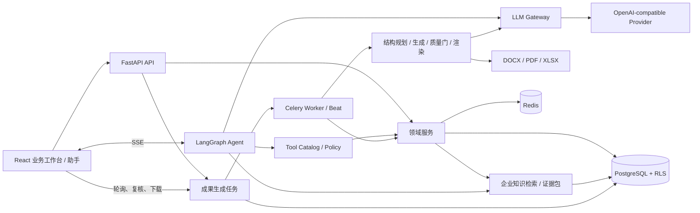

# Nexus AI Command 架构总览

## 系统形态

## 核心业务闭环

`企业资料 -> 入库与质量审核 -> 混合检索与证据包 -> 客户方案/投标工作区 -> Agent 深度生成 -> 结构与语义质量门 -> 人工确认 -> 成果中心与文件下载`。

- “企业资料”是普通用户主入口；知识关系图谱是检索和洞察支撑，不取代文档资产管理。
- 方案与投标工作区保存需求、客户、预算、仪器谱系、证据、版本和复核状态。
- 对话中的“制作精品成果”会创建持久化任务，而不是直接把当前消息机械转换为文件。
- 未通过证据或质量门的结果只标记为审核草稿，不得伪装为可对外交付文件。

## 关键边界

- 新页面和渐进重构以 `src/pages` 负责路由装配为目标；远端状态进入 `src/hooks`，领域 UI 进入 `src/features`/`src/components`。
- `nexus_backend/app/routers` 处理 HTTP 契约，不承载长业务事务。
- `nexus_backend/app/services` 承载用例；`app/domains` 是渐进 DDD 的责任登记表。
- `app/agent` 负责编排，不直接绕过服务层修改业务数据。
- `app/tools` 是 Agent 到业务能力的受控适配层。
- `app/core` 提供认证、租户、配置、限流、可观测和数据库基础设施。
- `artifact_generation_service.py`、`artifact_llm_judge.py` 与成果任务服务构成交付内核；页面入口不得各自复制生成和质检逻辑。

## 关键不变量

1. 每次业务写入均可归属到用户、组织、请求/Agent run 和时间。
2. 跨表状态变更使用事务 RPC、幂等键或明确补偿，不依赖“连续请求大概率成功”。
3. 默认模型由后端成本策略决定，前端选择不能绕过生产强制模型。
4. 长任务由 Celery/持久化运行状态承载，不依赖单个 Web 进程存活。
5. 数据库迁移只前向追加，并通过 Schema/RLS/重放门禁。
6. 企业知识检索和成果下载都绑定服务端解析的组织上下文；前端传入的租户 ID 不是授权依据。
7. 对外成果必须保留选用资料、证据引用、质量快照、人工确认和生成版本。

详细入口见 `docs/handbook/`；实时规模见 `docs/handbook/generated/inventory.md`。
