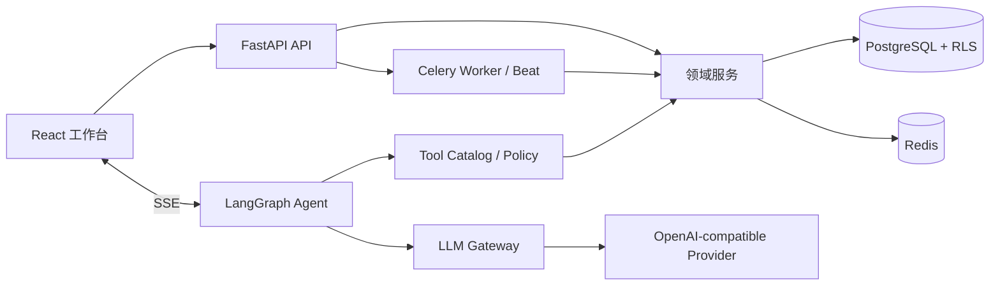

# Nexus AI Command 架构总览

## 系统形态

## 关键边界

- `src/pages` 只做路由页面装配；远端状态进入 `src/hooks`，通用 UI 进入 `src/components`。
- `nexus_backend/app/routers` 处理 HTTP 契约，不承载长业务事务。
- `nexus_backend/app/services` 承载用例；`app/domains` 是渐进 DDD 的责任登记表。
- `app/agent` 负责编排，不直接绕过服务层修改业务数据。
- `app/tools` 是 Agent 到业务能力的受控适配层。
- `app/core` 提供认证、租户、配置、限流、可观测和数据库基础设施。

## 关键不变量

1. 每次业务写入均可归属到用户、组织、请求/Agent run 和时间。
2. 跨表状态变更使用事务 RPC、幂等键或明确补偿，不依赖“连续请求大概率成功”。
3. 默认模型由后端成本策略决定，前端选择不能绕过生产强制模型。
4. 长任务由 Celery/持久化运行状态承载，不依赖单个 Web 进程存活。
5. 数据库迁移只前向追加，并通过 Schema/RLS/重放门禁。

详细入口见 `docs/handbook/`；实时规模见 `docs/handbook/generated/inventory.md`。
