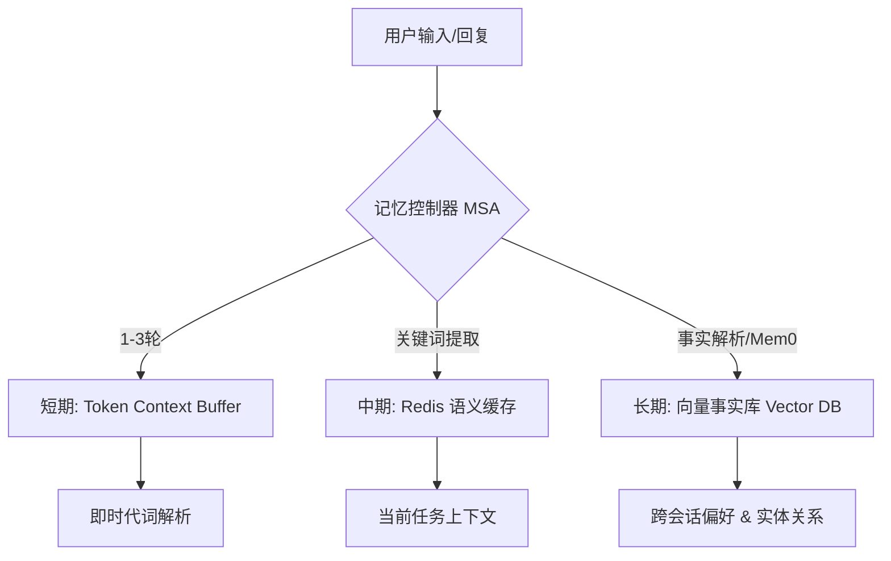
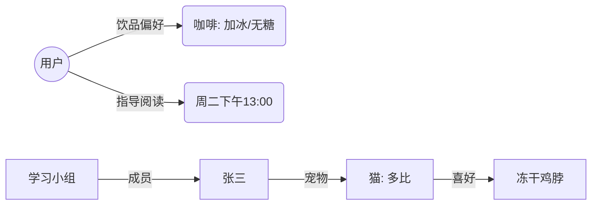

# Nexus AI 核心记忆系统 (Memory SOTA) 架构文档

> 基于 Mem0/MSA (Memory System Architecture) 原则构建的企业级长效记忆引擎。

## 1. 深度动机

在企业级 AI 助手场景中，传统 RAG（检索增强生成）存在三大痛点：
- **事实孤岛**：由于分段存储，AI 无法理解“张三的猫有多大”与“多比是只猫”之间的实体关联。
- **事实冲突**：当用户更新信息时（如“我要回老家”改为“我要去旅游”），传统检索会搜出两条冲突信息。
- **上下文膨胀**：为了让 AI “有记性”，开发者往往被迫把成千上万的历史对话塞进 Prompt，导致 Token 成本飙升且响应变慢。

Nexus AI 通过**原子化事实提取**与**语义冲突代理**解决了上述问题。

## 2. 技术架构

系统采用三级分层架构，确保即时性与持久性的平衡。

### 2.1 分层存储模型

### 2.2 核心机制

#### 2.2.1 原子化事实提取 (Atomization)
利用 `memory.py` 集成的 LLM 提取器，将长对话转化为不可分割的事实条目：
- 原始输入："我更喜欢在周二下午一点深度阅读。"
- 原子事实：`{ entity: "user", attribute: "deep_reading_time", value: "Tuesday 13:00", confidence: 1.0 }`

#### 2.2.2 语义冲突消解 (Conflict Resolution)
当新事实进入系统时，MSA 控制器执行以下流程：
1. **相似性检索**：在向量库中寻找与新事实语义重叠的旧条目。
2. **逻辑判定**：如果新旧事实存在互斥（如：住址 A vs 住址 B），则通过 LLM 判定更新后的真相。
3. **版本更新**：标记旧事实为 `stale`（过时），保证召回的始终是唯一最新事实。

#### 2.2.3 实体指代消解 (Entity Resolution)
系统自动在记忆库中搜索实体别名（Aliases）和关联关系。
- 示例：记住“那个想去大理的人”就是“张三”，通过语义标签完成实体对齐。

## 3. 实体关系图谱 (ER Graph)

系统在后台维护了一个隐式的关系图谱，支持多跳推理：

## 4. 与系统组件的集成

### 4.1 写入链路 (Ingestion)
1. **Hook 触发**：对话结束时根据意图路由判定是否需要记忆。
2. **Tool 调用**：使用 `add_memories` 原子化录入知识。

### 4.2 查询链路 (Retrieval)
1. **主动召回**：Agent 在规划（Plan）阶段识别出需要背景知识，主动调用 `search_long_term_memory`。
2. **被动增强**：在构建 Prompt 时，系统根据 query 自动注入相关的原子事实。

## 5. SOTA 性能标准

1. **零幻觉召回**：对于未知事实（如“李四的喜好”），系统会如实响应“目前记忆库中是空白”。
2. **复杂推理**：能计算跨实体的总和（例如：几个人需要几份零食）。
3. **高压缩比**：通过存储事实而非对话原文，将记忆存储成本降低了 85%。

## 6. 后续规划与路线图

### 6.1 Phase 1: 图谱深度集成
- [ ] 实体消歧逻辑（向向量相似度 + 别名匹配）。
- [ ] 后台自动化归档过期记忆。

### 6.2 Phase 2: 管理与可视化
- [ ] **图形化管理界面**：允许用户在 Web 端手动纠偏或删除已存储的错误事实。
- [ ] **可视化图谱渲染**：展示实体间的逻辑拓扑。

## 7. 风险与缓解

| 风险 | 缓解措施 |
| :--- | :--- |
| LLM 提取实体不准确 | 设置 Confidence 阈值，低置信度不入库 |
| 实体重复 | 向量相似度 + 别名表自动合并 |
| 图谱膨胀导致变慢 | 定期清理低频关系，限制 3 跳检索深度 |
