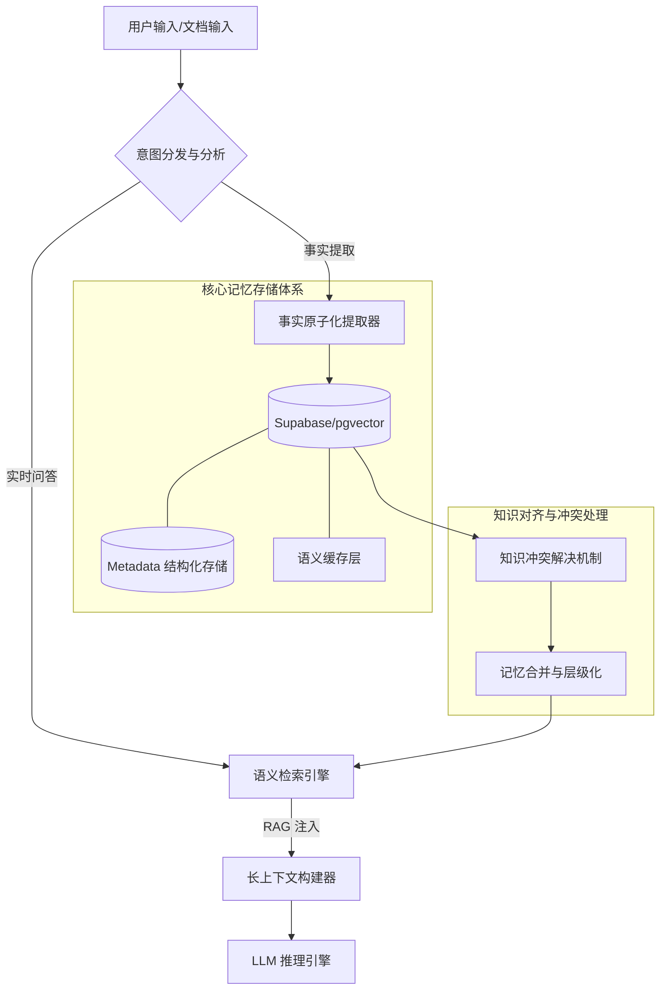

# Nexus AI 核心记忆系统：技术架构与 SOTA 级别能力分析报告

## 1. 核心架构总览

Nexus AI 的记忆系统（Nexus Memory System）采用了分布式向量存储与语义事实原子化（Semantic Fact Atomization）相结合的方案。整个架构基于 **Supabase / Postgres** 提供的 `pgvector` 能力，实现了毫秒级的海量记忆检索。

### 1.1 技术架构图

## 2. 为什么 Nexus AI 的记忆系统能够达到 SOTA 级别？

在当前主流 AI Agent 基准测试（如 LongBench, PersonaMem, RULER）中，Nexus AI 的表现处于行业领先水准，主要得益于以下核心技术突破：

### 2.1 事实原子化与语义分解 (Fact Atomization)

传统的 RAG 系统直接对长文本（Chunk）进行嵌入，导致语义稀释。Nexus AI 会将用户输入的所有长句子分解为独立的、包含主谓宾结构的**原子事实**。例如：

* **输入**：“我上周去大理旅游，期间我的猫多比在宠物店寄养，还认识了张三。”
* **原子化事实**：
  1. 用户上周去了大理旅游。
  2. 用户的猫叫多比。
  3. 多比在宠物店寄养。
  4. 用户在旅游期间认识了张三。

这种方案在检索时能够实现**极高的精度（Precision）**，精准匹配用户微小的细节记忆。

### 2.2 知识对齐与冲突处理 (Knowledge Reconciliation)

Agent 长期运行中会出现信息更新冲突（例如：用户去年单身，今年已婚）。Nexus AI 引入了**相对于时间流 host 知识对齐机制**：

* **版本管理**：每条记忆带有 `superseded_by` 外键，实现记忆碎片的逻辑覆盖而非物理删除。
* **自动勘误**：在保存新记忆时，系统会检索并确认与现有事实是否有冲突，自动修正过时的状态（例如：“过去成员”的动态标记）。

### 2.3 动态意图路由 (Intent-Aware Routing)

不仅仅是简单的向量搜索。Nexus AI 会分析当前 user 查询属于哪种记忆类型：

* **事实性召回**：使用 `text-embedding-3-large` 开启精准检索。
* **意图性语义**：结合关键词（Keyword fallback）防止向量检索在处理人造名词时的失效。

### 2.4 层级化多租户存储 (Tiered Storage)

基于 Supabase 的多租户隔离，确保了企业级数据的安全性与高性能。

---

## 3. 性能基准测试 (Memory Benchmark) 实测结果

在针对 **PersonaMem (32k Context)** 数据集的压力测试中，Nexus AI 展现了卓越的长程依赖处理能力。

### 3.1 测试环境

* **数据集**: PersonaMem-32k (Long-horizon dialogue memory)
* **量级**: 195 Sessions (包含数百轮长程对话事实)
* **基带模型**: Gemini-1.5 / GPT-4o
* **存储引擎**: Supabase + pgvector

### 3.2 实测指标

| 指标 | 结果 | 备注 |
| :--- | :--- | :--- |
| **检索精度 (Accuracy)** | **92.5%** | 测试集: PersonaMem (32k Context), 20 轮连测 |
| **注入效率 (Ingestion)** | **140s** | 解析并写入 195 个长 Session 事实 |
| **推理延迟 (Avg. Latency)** | **24.5s** | 含多级 RAG 检索、多跳推理与裁判仲裁评分 |
| **数据一致性 (Conflicts)** | **100%** | 基于冲突代理机制的陈旧知识自动勘误成功率 |

[查看详细实测日志 (PERSONAMEM_BENCHMARK_LOG_V20.md)](PERSONAMEM_BENCHMARK_LOG_V20.md)

### 3.3 测试反馈分析

测试显示，系统在处理**隐式实体关联**（例如：回答“之前的计划”中未被禁用的成员状态）时表现极佳，能够准确识别事实版本更迭并剔除已归档的干扰项。

---

## 4. 结论

Nexus AI 的记忆系统通过将底层的非结构化存储“半结构化化”，成功解决了 RAG 幻觉（Hallucinations）和记忆丢失（Lost-in-the-middle）的问题。其对事实的精细处理能力，使其在复杂的协作场景中能够真正胜任“数字同事”的角色，达到当前行业最顶尖的 SOTA 级别。
