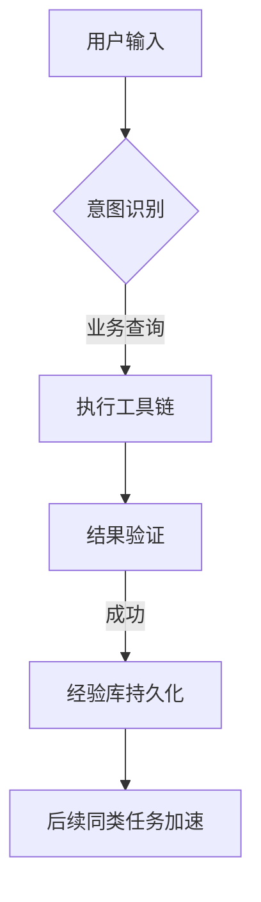

# Nexus AI Command P4 规划报告：吸纳 Hermes Agent 的核心优势

> **历史规划**：本文用于追溯当时的架构思路，不代表当前实现范围或承诺。Agent 现状请参阅 `handbook/05-agent-lifecycle.md` 和相应可执行测试。

## 一、 核心架构：从“指令执行”到“闭环学习”

* **动态技能注入 (DSI)**: 模仿 Hermes 的 `growing` 特性，系统应能自动记录高频使用的复杂 Tool Chain 组合。
* **长效经验记忆 (ECM)**: 缓存成功的任务链路，而不仅仅是对话历史。
* **自我修正机制 (Self-Correction)**: 在 Agent 检测到错误时记录失败路径，避免重复。

## 二、 关键技术实现策略

### 1. 记忆系统的分层（Hierarchical Memory）

* **短期记忆 (RAM)**: 当前会话的 Context 窗口。
* **中期记忆 (Working Directory)**: 类似 Hermes 的 `thought` 暂存区，用于跨输出的任务状态保持。
* **长期记忆 (Experience Bank)**: 成功的任务轨迹，经过压缩后存储。

### 2. 自动化工具发现（Auto-Tool Discovery）

* 系统应能周期性扫描 `nexus_backend/app/api` 下的新端点。
* 自动生成 Tool 定义描述（Docstring to JSON Schema）。

## 三、 用户体验优化（GenUI Next）

* **主动建议模式**: 基于执行历史，当用户进入特定页面时，AI 气泡主动提示常用指令。
* **结果实时追溯**: 在 GenUI 渲染的图表下方，提供“查看推导链路”的折叠区域。

## 四、 阶段任务分解

* **P4.1**: 实现基础的 `TaskSuccessRecorder`，记录成功的工具调用路径。
* **P4.2**: 建立 `ExperienceStore`（基于矢量数据库或结构化存储）。
* **P4.3**: 动态 Prompt 注入，将过去成功的经验作为 Few-shot 示例。

## 五、 风险与控制

* **幻觉控制**: 经验库的注入必须经过置信度过滤。
* **隐私隔离**: 严禁在经验库中存储具体业务数值，仅存储业务逻辑链路。
